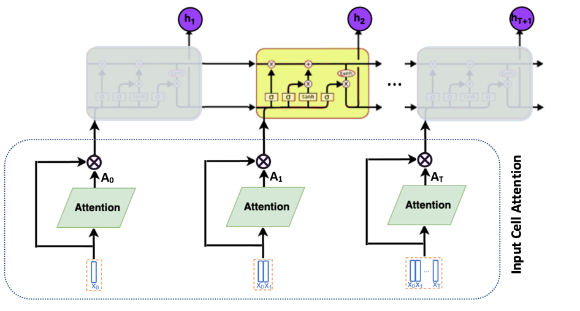
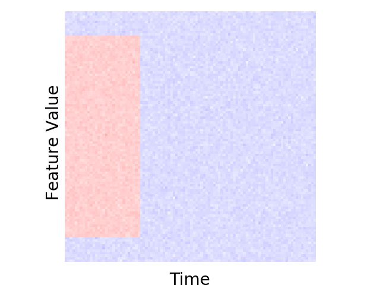
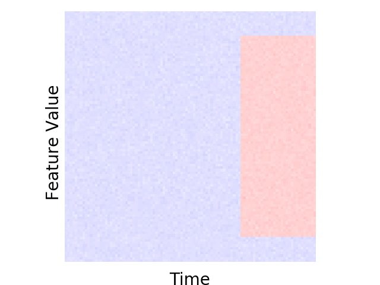
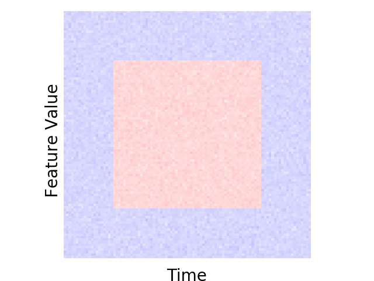
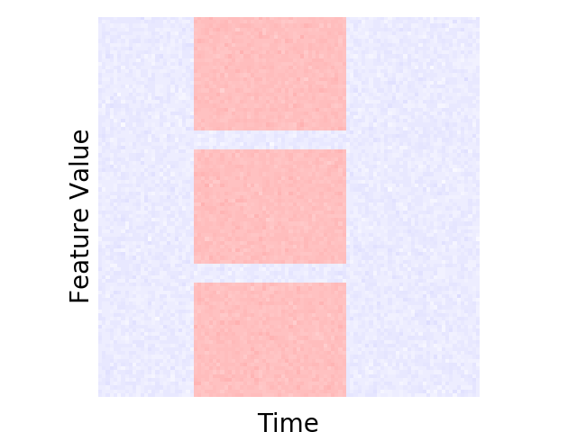
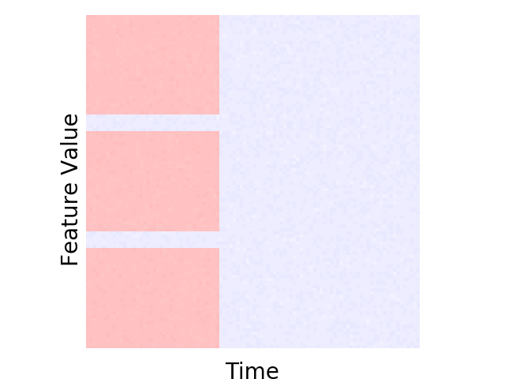
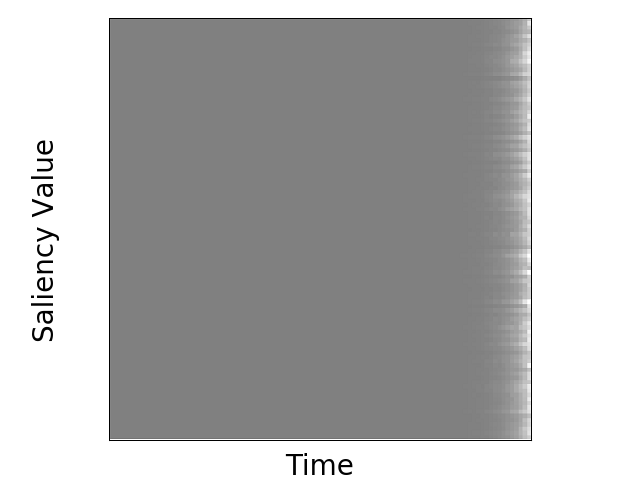
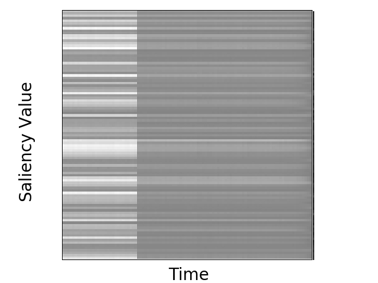

# Input-Cell Attention
Code implementing architecture introduced in "Input-Cell Attention Reduces Vanishing Saliency of Recurrent Neural Networks" by
Aya Abdelsalam Ismail, Mohamed Gunady, Luiz Pessoa, Hector Corrada Bravo*, Soheil Feizi*.



## Overview:
Recent efforts to improve the interpretability of deep neural networks use saliency to characterize the importance of input features in predictions made by models. Work on interpretability using saliency-based methods on Recurrent Neural Networks (RNNs) has mostly targeted language tasks, and their applicability to time series data is less understood. In this work we analyze saliency-based methods for RNNs, both classical and gated cell architectures. We show that RNN saliency vanishes over time, biasing detection of salient features only to later time steps and are, therefore, incapable of reliably detecting important features at arbitrary time intervals. To address this vanishing saliency problem, we propose a novel RNN cell structure (input-cell attention), which can extend any RNN cell architecture. At each time step, instead of only looking at the current input vector, input-cell attention uses a fixed-size matrix embedding, each row of the matrix attending to different inputs from current or previous time steps.  Using synthetic data, we show that the saliency map produced by the input-cell attention RNN is able to faithfully detect important features regardless of their occurrence in time. We also apply the input-cell attention RNN on a neuroscience task analyzing functional Magnetic Resonance Imaging (fMRI) data for human subjects performing a variety of tasks. In this case, we use saliency to characterize brain regions (input features) for which activity at specific time intervals is important to distinguish between tasks. We show that standard RNN architectures are only capable of detecting important brain regions in the last few time steps of the fMRI data, while the input-cell attention model is able to detect important brain region activity across time without latter time step biases. 

## Prerequisites:
* Python3.6
* NumPy
* Pytorch
* Matplotlib
* Pandas
* Sklearn
* Argparse
* Sys


## Usage
The code is available under scripts folder
### Synthetic Data creation:
Earlier Box                 |  Latter Box               |  Middle                  |  3 Middle Boxes            | 3 Earlier Boxes              
:-------------------------:|:-------------------------:|:-------------------------:|:-------------------------:|:-------------------------:
     |    |  |  |  

```python createSimulationData.py```

### Train Models:
- Input-cell attention is implemented in ```cell.py```
- To train different models use ```python trainModels.py```
### Plotting Saliency:
LSTM Saliency                 |  Input-Cell Attention  
:-------------------------:|:-------------------------:
     |  

- To calculate Saliency ```python saliency.py```
- To plot Saliency ```python plotSaliency.py```
### Calculating Accuracy Measure:
- To calculate accuracy measure used in paper ```python BoxStat.py```
